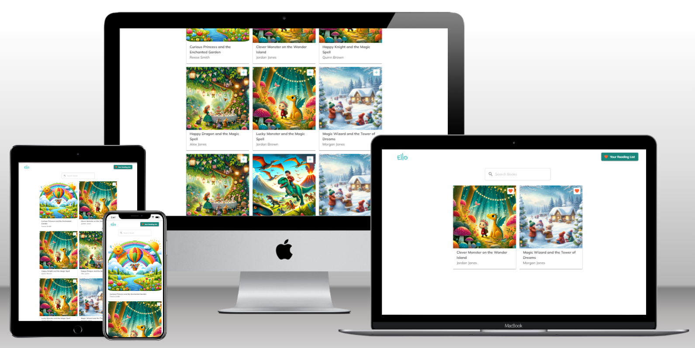

# Ello Fullstack Engineering Challenge

### Mockup



### Running the frontend

- In a unix terminal: Run

```
cd frontend && npm ci
```

-After the dependencies have downloaded, start the application by running:

```
npm run dev
```

The project starts on http://localhost:5173

### Data

To get access to data that you will use for this challenge you can switch into the `src/backend` folder and run

```bash
npm install
```

Then run the following command to start the server

```bash
npm start
```

This start a Graphql server at the url `http://localhost:4000/`, the server has a single query `books` that returns a list of books.

```graphql
query Books {
  books {
    author
    coverPhotoURL
    readingLevel
    title
  }
}
```

You can use this query to get the list of books to display in your frontend. You may need to adjust the `coverPhotoURL` to be a valid URL. The photos are in the `src/frontend/assets` directory.

### Styling Guidelines

- Use the "Mulish" Google font
- You can use the following colors (You don't have to use all but you can pick and choose from here)
  

### You will be evaluated on

- Code quality and organization.
- User experience and design.
- Beautiful and responsive UI.
